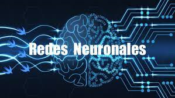
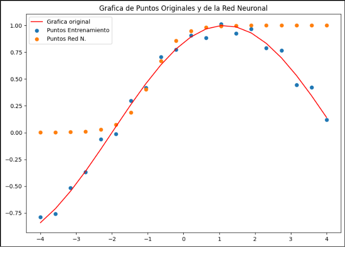
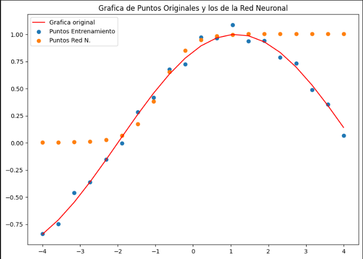
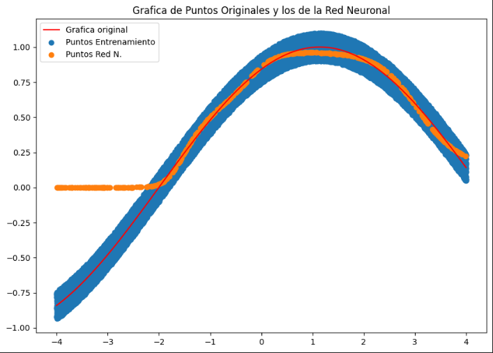
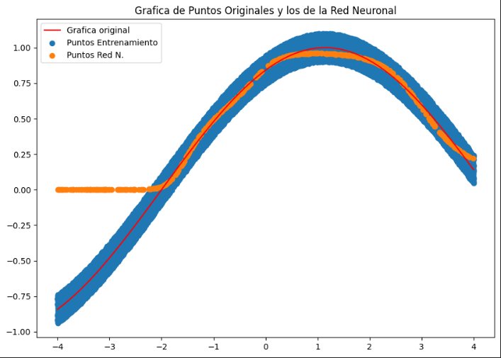
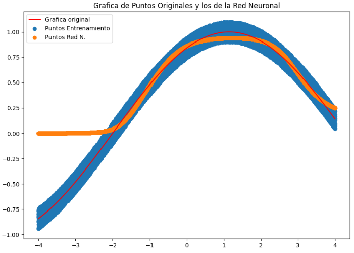
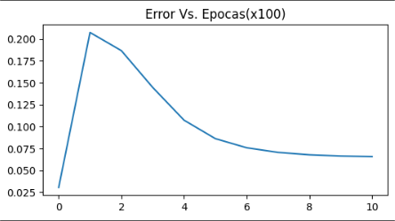
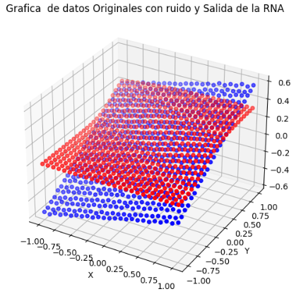

# Redes_Neuronales-from_scratch - En Construcción 🚧

Una red neuronal es un modelo computacional inspirado en la estructura y funcionamiento del cerebro humano. Consiste en una red de nodos interconectados, organizados en capas, donde cada nodo representa una neurona artificial que procesa información. Estas redes pueden aprender y realizar tareas complejas mediante el ajuste de los pesos de las conexiones entre nodos, utilizando algoritmos de aprendizaje automático. Las redes neuronales se utilizan en una variedad de aplicaciones, incluyendo reconocimiento de imágenes, procesamiento de lenguaje natural, pronóstico del tiempo, diagnóstico médico y conducción autónoma, entre otros. 

Las ventajas de las redes neuronales incluyen su capacidad para aprender patrones y realizar tareas complejas de forma autónoma, su adaptabilidad a una amplia gama de problemas y su capacidad para mejorar su rendimiento con grandes cantidades de datos. Además, las redes neuronales pueden manejar datos no lineales y realizar tareas de manera eficiente una vez entrenadas. Su utilidad radica en su capacidad para automatizar tareas difíciles o repetitivas, identificar patrones en grandes conjuntos de datos, tomar decisiones basadas en datos y realizar predicciones precisas en diversas áreas de aplicación, lo que las convierte en una herramienta invaluable en el campo del aprendizaje automático y la inteligencia artificial.

# Contenido Repositorio

## Estructura General de los Distintos Archivos 
### Creación de Datos 

Se crea una serie de puntos de una función lineal y luego se pasan por una función seno, para generar una función medianamente sencilla a puntos.

### Forward Pass 

Se inicializa de manera aleatoria los pesos y los bias de la red, y se multiplican los valores por los pesos, luego se le suma el bias, para después hacer la composición con la función de activación. 

Se utilizó una función sigmoide como función de activación.

### Función de Pérdida  

Se calcula el error cuadratico a partir de los datos predichos y los datos originales.

### Descenso del Gradiente - Backpropagation 

El descenso del gradiente se aplica sólo para las redes de una sola capa, en caso de poseer más de una capa se debe aplicar el algoritmo de backpropagation.

## [Red 3 Neuronas - Función Unidimensional](https://github.com/jrguignan/Redes_Neuronales-from_scratch/blob/main/RNA3.ipynb)

Red neuronal de 3 neuronas y una capa única

Se ve como los puntos proporcionados por la red se aproximan en cieto dominio de la función

## [Red 6 Neuronas](https://github.com/jrguignan/Redes_Neuronales-from_scratch/blob/main/RNA6.ipynb)

Red neuronal de 6 neuronas y una capa única.

Es una predicción muy similar a la red de 3 capas únicas.

## [Red de Prueba](https://github.com/jrguignan/Redes_Neuronales-from_scratch/blob/main/RNA%20_Prueba)

## [Red 3 Neuronas - Función Bidimensional (2D)](https://github.com/jrguignan/Redes_Neuronales-from_scratch/blob/main/RNA3_2D.ipynb)

